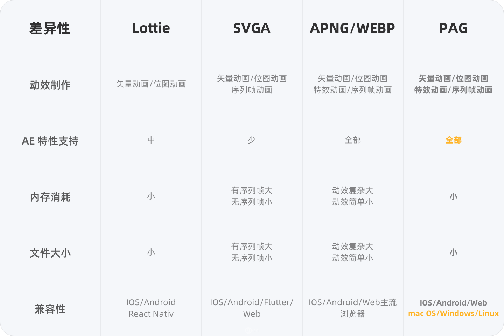
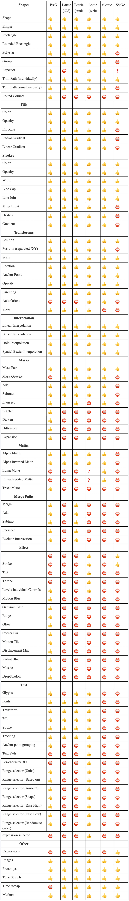

# lottie

[lottie官网](http://airbnb.io/lottie/#/)
[AE lottieFiles插件安装](https://www.jianji666.com/380441.html)

```
import lottie from 'lottie-web'

const lottieAnimation = lottie.loadAnimation({
  container: lottieRef.value,
  renderer: 'svg',
  loop: true,
  autoplay: true,
  animationData: redJson
})
lottieAnimation.play()

```


# svga

[svga官网](https://svga.io/)
[AE SVGAConverter插件安装](https://www.jianshu.com/p/16a1b478287d)

```
import SVGA from 'svgaplayerweb'

const player = new SVGA.Player('#svga')
const parser = new SVGA.Parser('#svga')
parser.load('/red.svga', function (videoItem) {
  player.setVideoItem(videoItem)
  player.startAnimation()
})
```

# pag

[pag官网](https://pag.art/)
[PAG安装](https://www.ui.cn/detail/609844.html)
[vue使用demo](https://github.com/libpag/pag-web)
> 在 public 文件夹下添加libpag.wasm
```
import { PAGInit } from 'libpag';
PAGInit().then((PAG) => {
const url = '/red.pag';
fetch(url)
  .then((response) => response.blob())
  .then(async (blob) => {
    const file = new window.File([blob], url.replace(/(.*\/)*([^.]+)/i, '$2'));
    const pagFile = await PAG.PAGFile.load(file);
    const pagView = await PAG.PAGView.init(pagFile, '#pag');
    pagView.setRepeatCount(0);
    await pagView.play();
  });
```


|      | lottie     | svga     | pag     |
| -------- | -------- | -------- | -------- |
| 文件格式 | json | svga | pag |
| 文件大小 | 412kb | 128kb | 49kb |
| 音效 | 不支持 | 支持 | 支持 |





css样式
.screen {mix-blend-mode: screen;}
filter: hue-rotate(121deg) saturate(100%) brightness(70%)
